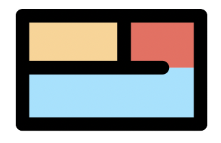
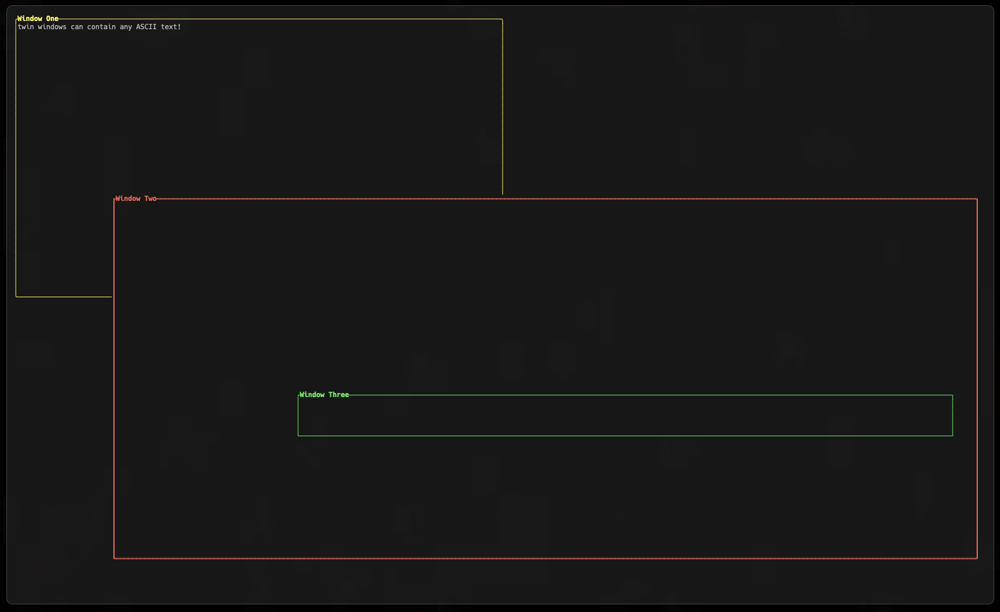

# twin

<p align="center">
    
    <div align="center">
        
        
    </div>
</p>

**IMPORTANT! THIS LIBRARY IS A WORK IN PROGRESS AND ANYTHING CAN CHANGE AT ANY MOMENT WITHOUT NOTICE!**

A simple, lightweight terminal graphics library for drawing rectangular windows. Windows can have any colour, title, border stlye and contents. 

## A Small Example
<p align="center">
    
</p>

*This example is the minimum code required to generate the windows in the image above.*

```c
int main () {
    twin_init();
    twin_terminal_start_config();

    struct winsize sz;
    ioctl(0, TIOCGWINSZ, &sz);

    twin_window_t* yellow_window = twin_create_window(2, sz.ws_row / 2, 1, sz/ws_col / 2);
    twin_set_title(yellow_window, "Window One");
    twin_set_colour(yellow_window, TWIN_BRIGHT_YELLOW);
    twin_set_general_style(yellow_window, TWIN_GENERAL_THIN_SOLID);
    twin_set_top_left_style(yellow_window, TWIN_TL_CURVED);
    twin_set_top_right_style(yellow_window, TWIN_TR_CURVED);
    twin_set_bottom_left_style(yellow_window, TWIN_BL_CURVED);
    twin_set_bottom_right_style(yellow_window, TWIN_BR_CURVED);
    twin_set_contents(yellow_window, "twin windows can contain any ASCII text!");

    twin_window_t* red_window = twin_create_window(sz.ws_row / 3, sz.ws_row - 5, 25, sz.ws_col - 4);
    twin_set_colour(red_window, TWIN_BRIGHT_RED);
    twin_set_title(red_window, "Window Two");
    twin_set_general_style(red_window, TWIN_GENERAL_BOLD_SOLID);

    twin_window_t* green_window = twin_create_window(sz.ws_row * 2 / 3, sz.ws_row - 20, 70, sz.ws_col - 10);
    twin_set_colour(green_window, TWIN_BRIGHT_GREEN);
    twin_set_title(green_window, "Window Three");

    twin_draw_all_windows();
    
    return 0;
}
```

## Demos

The source code for any demos shown here is located at [demos](./demos/). Each demo only contains the source .c file, and no header files are included, or included in the source.
